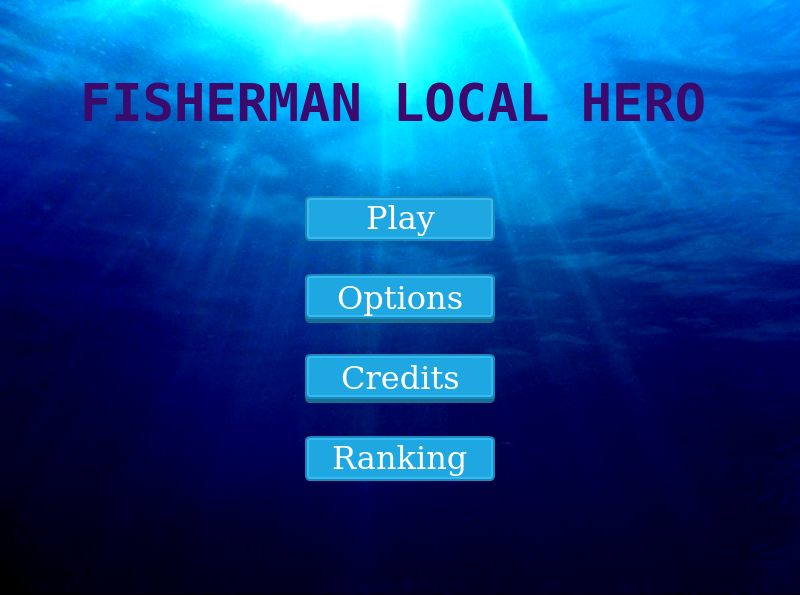
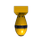

# Local Hero

Project created with Phaser 3 library.
The player must destroy its enemies by shooting arrows from his boat.
The scores are saved using API service.
Npm and Webpack are used to compile files and assets.
Test coverage made with Jest.

;

## Built With

- Phaser 3
- Webpack
- Javascript
- Jest

## Live Demo

<a href="https://thneves.github.io/Local-Hero/" target="_blank">Live version</a>

## Getting Started

To get a local copy up and running follow these simple example steps.

### Setup

- Please make a local copy of this repo by typing this command on your terminal.

`git clone https://github.com/thneves/Local-Hero`

- Then, go to the folder created with:

`cd Local-Hero`

### Install packages

- Run `npm install` in the terminal.

### Run Game Locally

- Run `npm run start` in the terminal.

### Run Test

- Run `npm test` in the terminal.

## Game Design

### List of Scenes
- Boot
- Preloader
- Title
- Game
- Options
- Credits
- Ranking

### Game Controls
|Command | Action |
|-------|-------|
|Left Arrow| To move left |
|Right Arrow| To move right |
|Up Arrow| To move up |
|Down Arrow| To move left |
|Space | Shoot Arrow |

### Enemies info

|Enemies                                     |Description                            |Points                |
|-------------------------------------------|---------------------------------------|--------------------|
|   |Big Submarine coming in your direction |23             |
| |A Boat that shoots lasers | 42|
|  |A bomb that will follow you  | 53 |

## Author
​
👤 **Thales Neves**
​
- GitHub: [@thneves](https://github.com/thneves)
- Twitter: [@tsneves11](https://twitter.com/tsneves11)
- LinkedIn: [Thales Neves](https://www.linkedin.com/in/thales-neves10/)

## 🤝 Contributing

Contributions, issues, and feature requests are welcome!

Feel free to check the [issues page]((https://github.com/thneves/Local-Hero/issues)).

## Show your support

Give a ⭐️ if you like this project!

## Acknowledgments

- [Open Game Arts](https://opengameart.org/) Free Games Assets